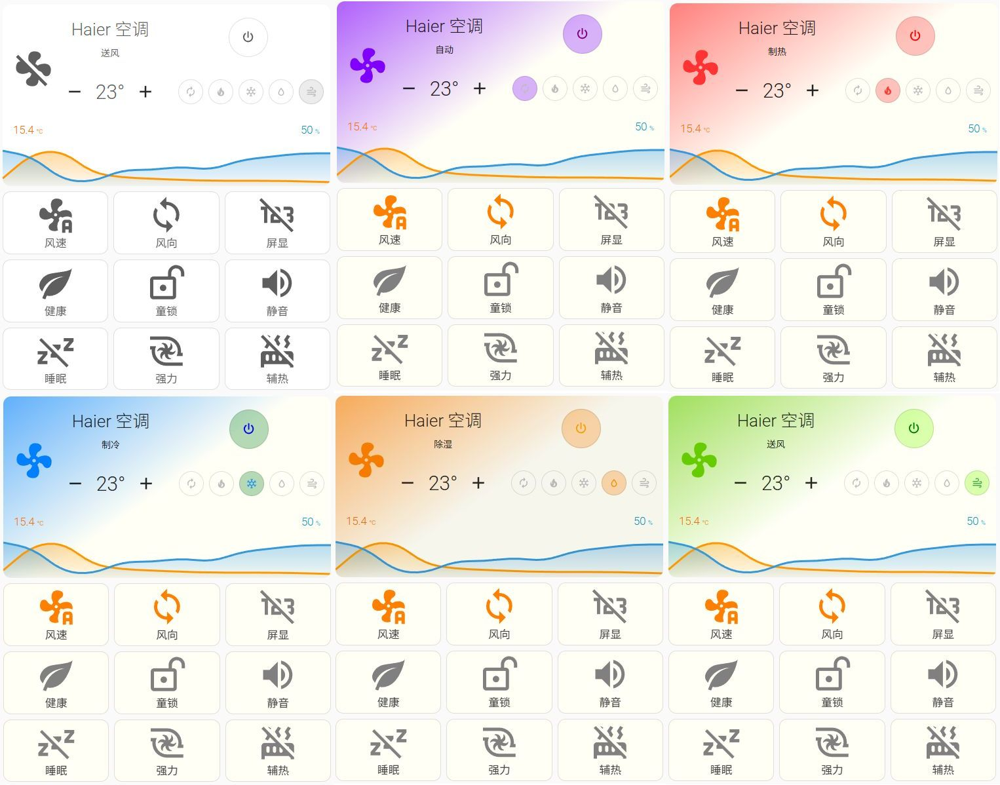

# ESPHome-based Haier Air Conditioner (KFR-26GW) IR Controller

## Overview

This project implements an **infrared (IR) controller for Haier KFR-26GW series air conditioners** based on ESPHome, using the Haier IR protocol provided by [IRremoteESP8266](https://github.com/crankyoldgit/IRremoteESP8266).

Instead of relying on ESPHome’s official `climate` component, this project exposes the air conditioner’s functionality through a combination of `number`, `switch`, and `select` components, allowing more fine-grained control over individual IR protocol features.

Currently supported features include:

- Power on / off
- Operation mode selection (Auto, Heat, Cool, Dry, Fan)
- Target temperature setting (16 °C – 30 °C)
- Swing mode selection
- Fan speed selection
- Scheduled power on / off
- Display status toggle
- Child lock toggle
- Auxiliary heating toggle
- Silent mode toggle
- Sleep mode toggle
- Turbo / powerful mode toggle
- Health mode toggle
- Self-cleaning mode toggle

> [!NOTE]
>  The ESPHome [climate component](https://esphome.io/components/climate/) does not provide a one-to-one functional mapping to the Haier IR protocol implemented in
>  [IRremoteESP8266](https://github.com/crankyoldgit/IRremoteESP8266).
>
> Therefore, this project is **not implemented using the climate component**.
>
> As a result, when integrated into Home Assistant, the standard `climate` UI card cannot be used.
>  Control must instead be performed via individual `number`, `switch`, and `select` entities.

> [!IMPORTANT]
>  All **core functionalities** (such as power control, mode selection, and temperature adjustment) are working as expected.
>
> However, during testing, **some advanced features** (e.g. display control and swing mode settings) were found to behave inconsistently with expectations.
>
> These issues are suspected to be related to implementation details of the corresponding Haier IR protocol in IRremoteESP8266 and require further investigation.

------

## Usage

### ESPHome Configuration

Since this component is not part of the official ESPHome repository, it must be imported via [external_components](https://esphome.io/components/external_components/).

Add the following configuration to your ESPHome YAML file:

```
external_components:
  - source: github://CCBP/ESPHome-HaierAC_KFR26GW-IRController@main
    components: [haier_ac_kfr26gw]

haier_ac_kfr26gw:
  id: haier_ac
  name: "Haier Air Conditioner"
  pin: GPIO4
```

Where:

- `id`: Internal component ID used for references
- `name`: Display name shown in ESPHome / Home Assistant
- `pin`: GPIO pin connected to the IR LED

> [!WARNING]
>  Ensure that the IR LED is wired correctly and driven through an appropriate current-limiting resistor or transistor.
>  Improper wiring may result in insufficient IR range or GPIO damage.

------

#### Example Configuration

An example configuration file (`example.yaml`) is provided in the repository.

Before using it, create a `secrets.yaml` file in the **same directory** and fill in the following values according to your environment:

```
ota_password: 123456
wifi_ssid: my_wifi
wifi_password: 12345678
```

Then compile and flash the firmware using the ESPHome CLI:

```
esphome run example.yaml
```

This component supports both **ESP8266 and ESP32** platforms, provided that IR transmission hardware is available.

------

### Home Assistant Integration

Since this project is not implemented using the `climate` component, the **official Home Assistant climate card cannot be used**.

All controls are exposed as individual `number`, `switch`, and `select` entities.

To provide a more user-friendly and visually consistent control experience, an example Lovelace UI configuration file (`ui-lovelace.yaml`) is included in the repository. This file defines a custom air conditioner control card.

The UI design is adapted from the following community project:

- [【自制分享】[8.4更新]清爽简洁+自适应主题的空调卡片](https://bbs.hassbian.com/thread-26328-1-1.html)

#### UI Dependencies

Before using `ui-lovelace.yaml`, make sure the following frontend plugins are installed in Home Assistant:

- Decluttering Card
- Mushroom Card
- Button Card
- Mini Graph Card
- Card Mod

#### UI Preview



------

## Known Issues and TODO

The project is functionally usable, but there are still known issues and areas for improvement.

### Functional Issues and Bug Fixes

- Systematically test all Haier-related protocol fields provided by IRremoteESP8266
- Analyze and fix incorrect behavior in:
  - Display status control
  - Swing mode configuration

### ESPHome Component Improvements

- Reduce and refactor duplicated code (e.g. highly similar `select` and `switch` callback logic)
- Improve scheduled power on / off functionality:
  - Consider combining `select` and `datetime` components
  - Improve usability on the Home Assistant side
- Integrate ESPHome Web Server `sorting_weight` to improve entity ordering in the web UI
- Disable non-core features by default, enabling them explicitly via YAML configuration

### Home Assistant Lovelace UI Improvements

- Split template definitions in `ui-lovelace.yaml` into separate files for better maintainability
- Introduce reusable `select` templates to simplify:
  - Swing mode selection
  - Fan speed selection cards
- Add a dedicated scheduling card:
  - ESPHome executes actions only after the target time is reached
- Provide detailed usage documentation for `ui-lovelace.yaml`
- Optimize color schemes for different operation modes

## Reference

- [ChatGPT](https://chatgpt.com/)
- [DeepSeek](https://chat.deepseek.com/)
- [【自制分享】[8.4更新]清爽简洁+自适应主题的空调卡片](https://bbs.hassbian.com/thread-26328-1-1.html)
- [IRremoteESP8266](https://github.com/crankyoldgit/IRremoteESP8266)